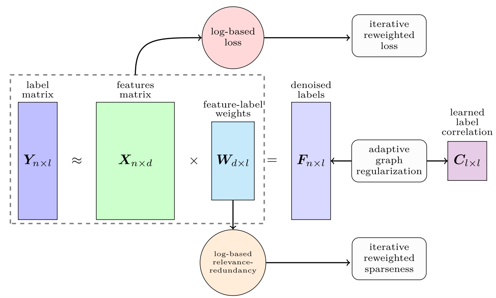

# 


# [Robust log-based multi-label feature selection with dynamic label correlation and relevance–redundancy optimization (RLBMLFS)](https://doi.org/10.1016/j.knosys.2026.115825)

[](https://doi.org/10.1016/j.knosys.2026.115825)
[](https://pytorch.org/)

Official implementation of the **RLBMLFS** framework as presented in *Knowledge-Based Systems (2026)*.

<p align="center">
  
</p>

## 📖 Abstract
tures, which jointly degrade learning accuracy and generalization. Although existing multi-label feature selection methods often adopt the L2,1-norm to enhance robustness and induce sparsity, this formulation remains sensitive to extreme noise, relies on static label correlation modeling, and inadequately controls redundancy among selected features. To address these limitations, we propose Robust Log-based Multi-Label Feature Selection with Dynamic Label Correlation and Relevance–Redundancy Optimization (RLBMLFS). The proposed method introduces an element-wise logarithmic robust loss that effectively suppresses the influence of large reconstruction errors, providing stronger resilience to noisy labels than conventional sample-wise losses. In addition, RLBMLFS learns label dependencies dynamically from reconstructed labels, yielding a stable and adaptive label correlation structure that mitigates noise propagation. To jointly promote sparsity and reduce feature redundancy, we further incorporate a logarithmic redundancy-aware penalty together with an L2,log pseudo-norm regularization, which offers a closer approximation to L0-norm sparsity while alleviating the dominance of large feature weights. Extensive experiments on 17 real-world multi-label datasets across five evaluation metrics demonstrate that RLBMLFS consistently outperforms state-of-the-art methods in terms of robustness, sparsity quality, and classification performance. 

---
## 🔗 Citation

If you use this repository or its implementation in your research, please cite **our paper**:

```bibtex
@article{faraji2026robust,
  title={Robust log-based multi-label feature selection with dynamic label correlation and relevance-redundancy optimization},
  author={Faraji, Mohammad and Seyedi, Amjad and Tab, Fardin Akhlaghian},
  journal={Knowledge-Based Systems},
  pages={115825},
  year={2026},
  publisher={Elsevier}
}
```
